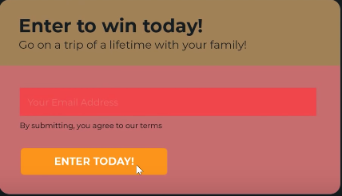
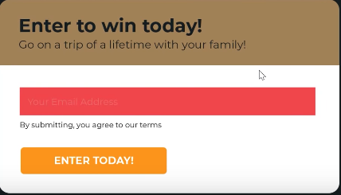
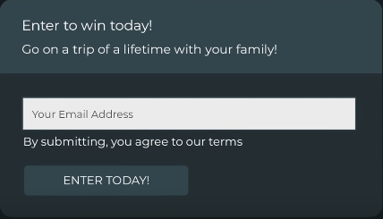

# Learn Design(i decided to do this cause my design skills suck)

## Color & Contrast

### An example of a poorly designed component color-wise

### Why Bad?

- Input placeholder doesn't have enough to contrast to be seen.
- Top and bottom part don't have enough contrast.

### Improvements

Now the bottom part contrasts with the top part.

Now the text in the upper part stands out a bit better

This also works

Converting to dark theme while maintaining this color and contrast

## White Space

### An example of a poorly designed component

### Why Bad?

The spacing is inconsistent.

- The big title on the top has a lot larger top margin and bottom margin.
- The caption below the input is poorly aligned
- The placeholder in the input box sticks onto the left side.

## Visual Hierarchy

### An example of a poorly designed component

### Why Bad?

No catchy content, in other words, you eye doesn't know where to look first.

- The heading has the same font size as the sub heading
- The button has the same color as the upper part

## Complexity vs Simplicity

### An example of a component with too much redundant junk

### Why Bad

- That freaking shadows and gradients which make the thing look much worse.

If you compare it to this simple component

You see the shadows and gradients are nothing more than stupid looking stuff that destroys the entire component.

You can use stuff like shadows and gradients, only if you can use them properly.

## Consistency

### Inconsistent example

### Why?

- Inconsistent font
- Inconsistent alignment
- Inconsistent white space

## Scale

### Example

- Tiny placeholder
- Button text too big
